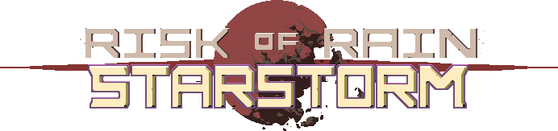

Starstorm Returns is a work-in-progress mod for Risk of Rain Returns that remasters the original Starstorm mod for Risk of Rain 1. It adds new survivors, enemies, stages, difficulties, and items to the game.

## Feedback, Bug Reports, and Known Issues
- Bugs can be reported on the [GitHub Issues page](https://github.com/RobomandosLab/StarstormReturns)

## Credits & Thanks
- Neik: Creator of Starstorm 1
- Buns: Project management
- Kris: Programmer
- [Azuline](https://bsky.app/profile/azulineskye.bsky.social): Programmer
- Battery: Programmer
- TRYAGAIN211: Programmer
- EarthZebra: Programmer
- Opal: Pixel artist & programmer
- Altzeus: Music & programmer
- [Winslow](https://bsky.app/profile/winslowror.bsky.social): Pixel artist
- isDahMaster: Pixel artist
- [Beebo](https://bsky.app/profile/beebogreebo.bsky.social): Pixel artist
- [TangoKnight](https://bsky.app/profile/tangoknight.bsky.social): Pixel artist
- Redacted: Pixel artist
- [Dontio](https://ko-fi.com/donito): Pixel artist
- [Meursault](https://ko-fi.com/fyrebw28545): Pixel artist
- [RicottaKitten](https://bsky.app/profile/boreeddddd.bsky.social): Pixel artist
- [Gummies](https://bsky.app/profile/gummies139.bsky.social): Pixel artist

## Special Thanks
- Neik for creating a wonderful mod and community we have loved and enjoyed.
- Dee for design help and development guidance
- Swuff for helping kickstart the codebase